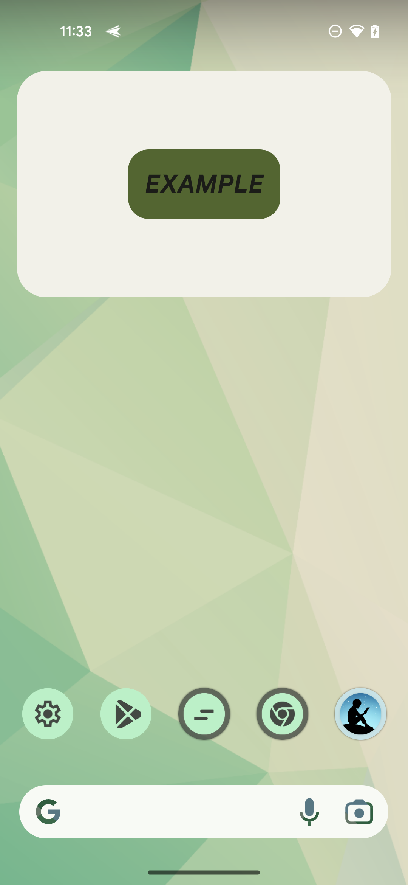
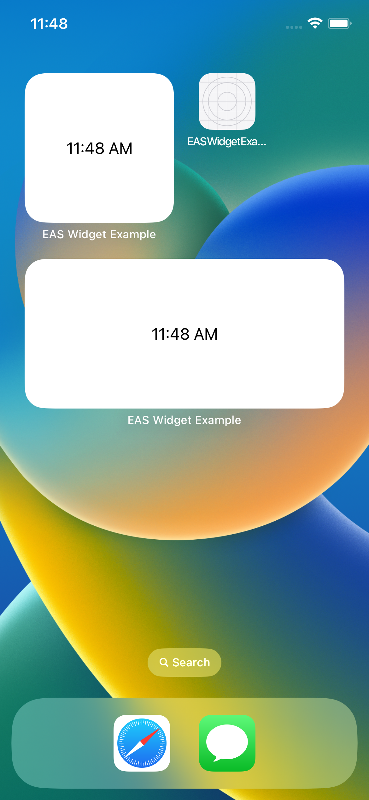

Here is an example of a Widget in Expo's Managed Workflow (EAS).


| Android | iOS |
|:-----------:|:------------:|
|||


## Folders

- plugin: Config Plugins
- widget: Template files for widget


## Set up

### Install

`yarn install`


### Edit app.json

Edit following fields.

- `android.package`
- `ios.bundleIdentifier`
- `extra.eas.build.experimental.ios.appExtensions`
- `<APPLE_DEV_TEAM_ID>` in `plugins`

## Run on Local

```
yarn android
# or
yarn ios
```

## Build on Server (EAS)

```
eas build --platform all --profile preview
```


